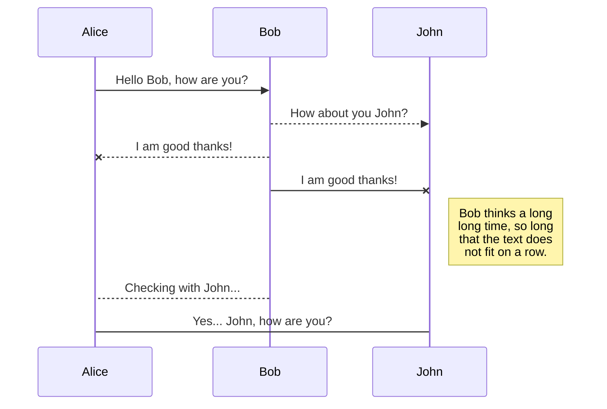
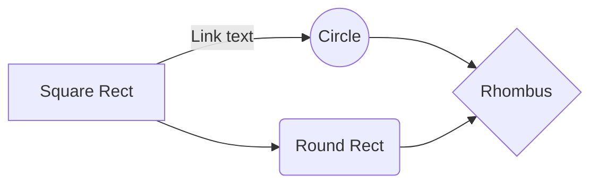

# iProtekt - Operator File Transfer README

## Prerequisites
- A way to export a table or set of data to a CSV file (see **CSV File Format** section below for information on the columns and data types you will need to provide, along with the order in which these columns need to be.  
- An SFTP client application or command line tool (e.g. WinSCP, Cyberduck, PuTTY PSFTP, OpenSSH, etc.).
- An SSH public/private key pair (be sure to send us the public key, otherwise you won't be able to connect to our server).
- A username and password that we will provide you to access our server.

## CSV File Format

See the chart below for the accepted order and data types of your CSV columns (if the order of columns or data type is incorrect, an log file will generate outlining the error(s) in your CSV): 

|                |user_id |transaction_datetime  |transaction_type | transaction_amount |account_bal (optional) |
|----------------|--------|----------------------|-----------------|--------------------------|-----------------------|
|**Data Type**   |`STRING`|`DATETIME`            |`STRING`            |`NUMBER`          |`NUMBER`               | 

## How to Send A File

Once the CSV file format is correct, you can now send your file via SFTP. Follow the steps below to successfully send a file:
- First, open a connection using your SFTP client application or command line tool.
- Be sure to include the Server URL, Username and Password, and SSH private key inputs with the correct information.
- Once a connection with the server has been established, upload your CSV
- After the CSV is uploaded, be sure no errors were found. Refresh your SFTP connection to verify this (if there is an error, the file you just sent will be deleted and an error log will generate in the directory you are currently in. You will be able to download this file.

## UML diagrams

You can render UML diagrams using [Mermaid](https://mermaidjs.github.io/). For example, this will produce a sequence diagram:

And this will produce a flow chart:

